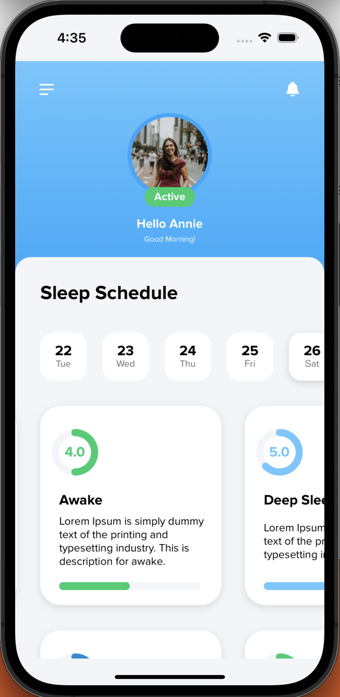
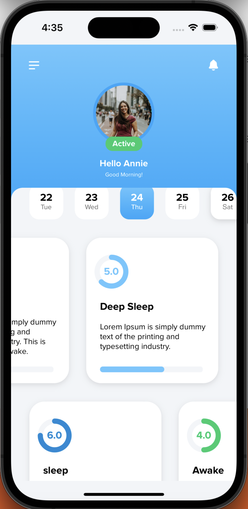
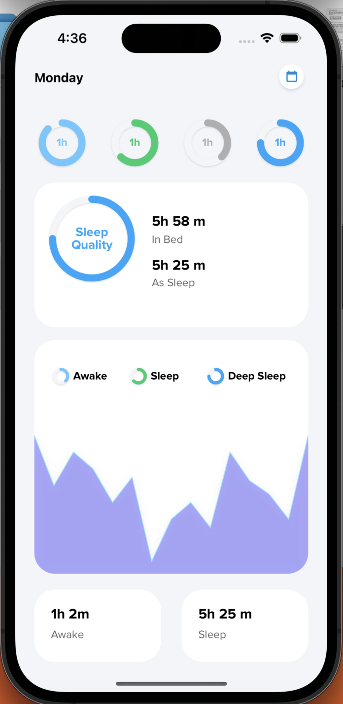

# PidebienDesignDemo App

Welcome to the PidebienDesignDemo App, an iOS application that depict the basic design of Pide bien which includes login, signup, home, side menu and bottom sheet sreen design. This README file provides an overview of the app, its features, and the skills showcased in its development.

## Screenshots

  
  
  
  
  

## Features

1. **MVVM Architecture**: The app follows the Model-View-ViewModel (MVVM) architectural pattern, which promotes separation of concerns and makes the codebase more modular and testable.

2. **UIKit Framework**: The PidebienDesignDemo App is built entirely using UIKit, Apple's framework for building user interfaces across all Apple platforms. This project leverages several UIKit components and features, including:
- ***Collection View***: Used to efficiently display and manage a collection of items in various layouts.
- ***Table View***: Employed to present structured data in a tabular format with rows and sections.
- ***Scroll View***: Utilized to enable smooth scrolling through content that exceeds the screen size.
- ***Blur Effect***: Applied to enhance the visual aesthetics of certain UI elements using a blurred background.
- ***Side Menu***: Integrated into the navigation flow to offer users quick access to different app sections or functionalities.
- ***Sheets***: Employed to display temporary modal views that slide in from the bottom or top, presenting contextual information or actions.
- ***Storyboards***: Utilized for designing high-level app flow and navigation between different screens, offering a visual representation of the app's structure.
- ***XIBs***: Utilized for creating individual interface components or views, supporting a modular approach to UI design.

## Requirements

- iOS 15.0+
- Xcode 13.0+
- Swift 5.5+

## How to Run

1. Clone the repository or download the ZIP file.
2. Open the `PidebienDesignDemo.xcodeproj` file in Xcode.
3. Choose the desired simulator or a connected iOS device.
4. Press the "Run" button (or use the shortcut `Cmd + R`) to build and run the app.

## Contributing

Contributions to the PidebienDesignDemo App are welcome! If you find any bugs, have feature suggestions, or want to contribute improvements, please feel free to open a pull request.

## Credits

The PidebienDesignDemo App is developed by **Sham Kumar**. If you have any questions or need assistance, you can reach out to me at ksham1999@gmail.com.

## License

The PidebienDesignDemo App is released under the [MIT License](LICENSE). You are free to use, modify, and distribute the app as per the terms of the license.
